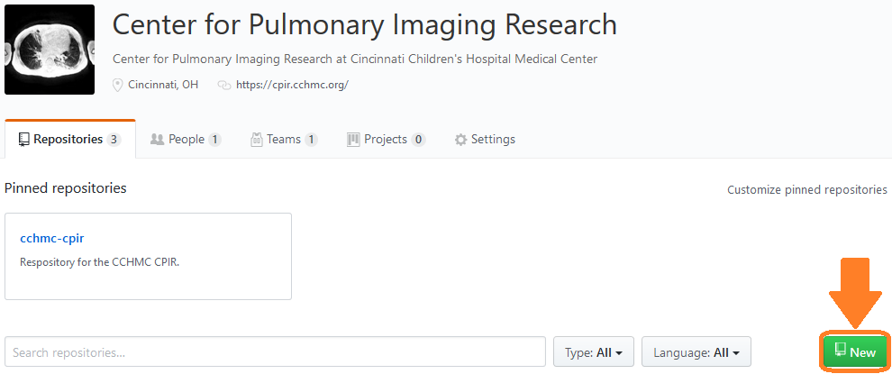

# Contributing

## Project management

**This** repository is simply a meta-page that describes the overall goals of the `cchmc-cpir` GitHub Organization. Remember that any projects should be **separate repositories** created under the organization. The **organization** groups all of the CPIR's projects together, and each **repository** is dedicated to a specific project.

Git is love, git is life (if you're designing software). Git and GitHub offer tons of powerful tools and tricks for creating and maintaining robust projects. **Briefly**, I'm going to lay out the important things to know about how you should contribute to **this organization**. A more software developer-oriented guide for using GitHub effectively can be found **[here](https://guides.github.com/introduction/flow/)**.

## How to use the CPIR's GitHub page

### Creating a repository
  * Creating a new repository can be done with the green "New" button on the CPIR's GitHub Organization page. 
  * Make sure you create a `README.md` file with your project and use descriptive naming conventions.

### Adding files
  * Be sure to keep your files well organized (folders, **descriptive naming**), etc.
    * This is a *little* less interesting for MATLAB, because its system of function paths, etc. is relatively easy to understand. But, it can still help to have dedicated folders for functions or data.
  * Can it be a function that takes just a few inputs? If so, it will work out a lot better than something that only takes an absolute filename that has to be changed before hitting the `run` button. It will also make it easier to change/add more stuff in the future.

### Editing existing files
  * Make your changes as needed (on your computer) then **_add_** -> **_commit_** -> **_push_**. [GitHub Desktop](https://desktop.github.com/) makes this pretty easy and intuitive. Your changes should then be reflected on the branch of the repository that you pushed to.
  * **Note:** If a file has been changed by someone else on the GitHub repository (i.e., on the online repository, and not the local one you're working from), you need to **_pull_** it first in order to update the branch heads. By doing this, you're adding your changes to the current version of the repository.

### Branches
  * If you're interested/need to, you can create a new branch of the repository to test some things out in. This means you will be copying the project's entire directory structure into a separate directory within the Git repository. Importantly, unless you **merge** the two back together, they will not have the same contents. Files updated in one branch will not be updated in another unless they are merged together.
  * This is useful if you're trying to build a new component/feature and don't want to screw anything up in the code you already have. Don't like how it's turning out? No consequences.
  
## About Git and GitHub :octocat:

### GitHub Desktop vs. Git CLI
  * If you're used to using Git or the command line in general, by all means feel free to use your favorite terminal to push & pull to/from this repository.
    * You can use a Linux/Mac terminal, or the free [Git Bash](https://gitforwindows.org/) tool for Windows
  * If you'd prefer to take a more GUI-oriented approach, GitHub offers a **[desktop application](https://desktop.github.com/)** for both Windows and macOS users (not Linux, unfortunately). This allows you to easily add files/folders to the repository, commit your changes to your preferred branch, and push them to GitHub without ever having to touch a terminal.

### How Git (with GitHub) works
  * Git allows you to create repositories for your code that you can work out of as you build and develop all of the functionality that you want.
  * The beauty of version control is that a full history of the files and their states at the point of any given commit will exist as long as this repository does. Need to revert to the form your reconstruction script was in as of a commit you made 8 months ago? Easy.
  * Git doesn't require you to use an online (remote) repository, but it makes it easy to collaborate with others by doing so. In fact, the only real differences between a remote and local repository exist in the features that GitHub lets you use (Markdown rendering like this, for example, or .gitignore files).
  * The general process for adding a file or making a change is the same: **add, commit, push.** You will add your changes (create a new file or edit an existing one), **commit** the changes to stage them for addition to this remote repository with a log message, and **push** your changes here. **Changes should be well documented, with commit messages explicitly stating what was altered.**
  * You _can_ edit files online using GitHub's editing functionality, but that is **highly** discouraged unless the file is Markdown or something else that you'd actually benefit from editing in a browser.
  * If you'd like to read more about Git, [this page](https://git-scm.com/about) should have what you're looking for.

## Comments, Documentation and Formatting

If someone else is going to use your code in the future, **please format well and write decent comments.** Few things are worse than inheriting someone's project and having to parse through each line just to understand what the general purpose of their software is. Write **brief and descriptive** comments as often as you think would be necessary for someone else to be able to grasp your thought process **without having to ask you any questions**. Good formatting is another key to writing understandable code. Especially with MATLAB, matrix indices can often be hard to read. Be liberal with newlines and indentations if it helps improve the readability of your software.

## MATLAB Style Guide

[This document](./MATLAB_style.pdf) is available in the [root directory](https://github.com/acochran50/cchmc-cpir). Not a requirement, but could you imagine a world where everyone wrote MATLAB code by the same standards? Whoa.

 

***

 

## [GitHub Flow](https://guides.github.com/introduction/flow/)

While any workflow is possible with Git/GitHub, here is a brief synopsis the general contribution process as described by the people at GitHub:

* **Creating a branch**
  * Features and new ideas should be in a separate branch that others can see, but that won't have any effects on the current working version of the project.
* **Adding commits**
  * Make some changes to the project in the new branch to flesh things out and work towards your new feature. Well-labeled commits make it easy for everyone else to see what you're working on, how you're working on it, and what your end goal might be.
  * Use **short, meaningful** commit messages.
* **Opening a pull request**
  * Light a signal fire so everyone knows you want to discuss what you're working on. The project can only move forward if everything is ship-shape, as decided by everyone.
* **Reviewing changes with everyone**
  * Pull requests are for discussions. Make sure everyone's opinions have been heard before moving too far ahead with something that constitutes a major project decision.
* **Deploying and testing**
  * Use GitHub to deploy your new feature and run tests before throwing the change into the working project source. Let everyone review the pieces and parts of your code if they'd like to. This is a final quality control check before making a direct alteration to the code that users will run.
* **Merging**
  * Changes verified? Add them to the production-level code.
  * **Pull requests** will maintain a history of the changes made to everything.
